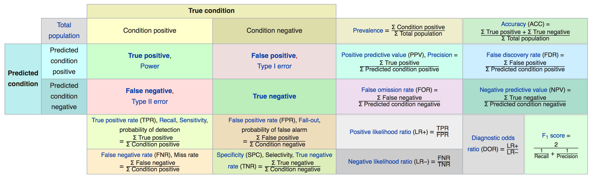

ML and Maths - cheatsheets: https://medium.com/machine-learning-in-practice/cheat-sheet-of-machine-learning-and-python-and-math-cheat-sheets-a4afe4e791b6

# ML Process

- Orthogonalization.  Steps:

  1. Fit training set well on cost function? No - try bigger network, etc
  2. Fit dev set well on cost function? No -  regularization, etc
  3. Fit test set well on cost function? No - bigger dev set
  4. Perform well in the real world? No - change dev se or cost function
  
  Source: https://www.coursera.org/learn/machine-learning-projects/lecture/FRvQe/orthogonalization

# Feature Engineering

## Missing data

- **Missing completely at random** - no relationship between missing data and other values
- **Missing at random** - some systematic relationship, e.g. women disclosing their weight
- **Missing not at random** - systematic relationship to missing values, e.g. depressed people not filling in a survey

One objective is to determine the type of missingness so that appropriate strategies can be put in place to deal with it.

## Examples

- Titanic: 

```
data = read.csv ...
data.isnull().sum()  # Count num rows with missing values for each column
data.isnull().mean() # Percent of rows with missing values for each column
```

Survivors could provide their age and cabin, but non-survivors couldn't (note that this view is simplified - people having a cabin could also have a lower survival rate for other reasons).

```
data['cabin_null'] = ...
data.groupBy(['Survived'])['cabin_null'].mean() # Percentage of survivors by whether or not they had a cabin.
```


## Missing data imputation

- http://www.stat.columbia.edu/~gelman/arm/missing.pdf


# ML Algorithms

## Terminology

 - **[Cross Validation](https://en.m.wikipedia.org/wiki/Cross-validation_(statistics))** In the basic approach, called k-fold CV, the training set is split into k smaller sets (other approaches can be used, but generally follow the same principles). [Youtube Intro](https://youtu.be/TIgfjmp-4BA)
 - **Accuracy** Error rate
 - **Precision and Recall** https://en.wikipedia.org/wiki/Precision_and_recall, http://scikit-learn.org/stable/auto_examples/model_selection/plot_precision_recall.html
 - **Convex function** There are many ways to rigorously define a convex function, but in loose terms it looks like the fabric of a trampoline being weighed down by a person standing on it. It means that a local minimum (see below) is also a global minimum, and the gradient at each point is pointing towards this minimum. You can get to the minimum by stepping along in the direction of these gradients, a technique called gradient descent. This is what you do to minimize your loss with respect to the parameters in your model. But you can’t do this with 0–1 loss because at each corner there is no gradient, and the dropoff from 0 to 1 has infinite slope. ([Source](https://www.quora.com/Why-is-the-0-1-indicator-function-a-poor-choice-for-loss-function))
 - **Local minimum** is a minimum relative to its immediately surrounding points, but it is not necessarily the **Global minimum**, which is the minimum of the entire function ([Source](https://frnsys.com/ai_notes/foundations/optimization.html)]
 - **Maxima and Minima**  
    - https://en.m.wikipedia.org/wiki/Maxima_and_minima
    - https://en.m.wikipedia.org/wiki/Mathematical_optimization
    - http://www.mash.dept.shef.ac.uk/Resources/c6_minma.pdf
 - **Cost/Loss/Error Function** is a function that maps an event or values of one or more variables onto a real number intuitively representing some "cost" associated with the event. An optimization problem seeks to minimize a loss function.
    - e.g. mean squared for linear regression
    - https://en.m.wikipedia.org/wiki/Cost_function
    - https://en.m.wikipedia.org/wiki/Loss_function
    - Linear - http://ml-cheatsheet.readthedocs.io/en/latest/linear_regression.html#cost-function
 - **Objective Function** is either a loss function or its negative (in specific domains, variously called a reward function, a profit function, a utility function, a fitness function, etc.), in which case it is to be maximized.
 - **Gradient Descent** is a first-order iterative optimization algorithm for finding the minimum of a function (minimise the cost). To find a local minimum of a function using gradient descent, one takes steps proportional to the negative of the gradient (or of the approximate gradient) of the function at the current point.  https://en.m.wikipedia.org/wiki/Gradient_descent http://ruder.io/optimizing-gradient-descent/
 - **L1 and L2 regularization** ([Source](https://www.quora.com/What-is-the-difference-between-L1-and-L2-regularization-How-does-it-solve-the-problem-of-overfitting-Which-regularizer-to-use-and-when))
    -  L1 regularization helps perform feature selection in sparse feature spaces, and that is a good practical reason to use L1 in some situations.
    - As a rule-of-thumb, you should always go for L2 in practice.
    - Even in the case when you have a strong reason to use L1 given the number of features, I would recommend going for Elastic Nets instead. Granted this will only be a practical option if you are doing linear/logistic regression. But, in that case, Elastic Nets have proved to be (in theory and in practice) better than L1/Lasso. Elastic Nets combine L1 and L2 regularization at the "only" cost of introducing another hyperparameter to tune.
 - **Link function** The link function provides the **relationship** between the **linear predictor** and the **mean of the distribution function**. There are many commonly used link functions, and their choice is informed by several considerations. ([Source](https://en.wikipedia.org/wiki/Generalized_linear_model#Link_function))
 - **Adjusted R<sup>2</sup>** R<sup>2</sup> adjusted for the number of predictors [blog](http://blog.minitab.com/blog/adventures-in-statistics-2/multiple-regession-analysis-use-adjusted-r-squared-and-predicted-r-squared-to-include-the-correct-number-of-variables)
 - **Surface 3D plot** plot of the cost function [[Example]](https://matplotlib.org/examples/mplot3d/surface3d_demo.html)
 - **Contour plot** A contour plot is a graphical technique for representing a 3-dimensional surface by plotting constant z slices, called contours, on a 2-dimensional format. That is, given a value for z, lines are drawn for connecting the (x,y) coordinates where that z value occurs. The contour plot is an alternative to a 3-D surface plot. [[Source]](http://www.itl.nist.gov/div898/handbook/eda/section3/contour.htm) [[Example]](https://matplotlib.org/examples/pylab_examples/contour_demo.html)
 - **Machine Learning** the machine learns for a better representation of the data (e.g. y=mx+b linear model) through an automatic search process
 - **Random Forest** are an ensemble learning method for classification, regression and other tasks, that operate by constructing a multitude of decision trees at training time and outputting the class that is the mode of the classes (classification) or mean prediction (regression) of the individual trees. Random decision forests correct for decision trees' habit of overfitting to their training set. [[Source]](https://en.wikipedia.org/wiki/Random_forest)
 - **Gradient Boosting** is a machine learning technique for regression and classification problems, which produces a prediction model in the form of an ensemble of weak prediction models, typically decision trees. [[Source]](https://en.wikipedia.org/wiki/Gradient_boosting)

## Loss Function
   - **zero-one (0-1)**
      - count the number of misclassified items.  Accuracy = count correctly classified / count total ([Source](https://stats.stackexchange.com/questions/284028/0-1-loss-function-explanation))
      - not used because it isn't convex (see [above](https://github.com/snowch-notes/machine-learning/blob/master/GENERAL.md#terminology)) and isn't differentiable ([Source](https://www.quora.com/Why-is-the-0-1-indicator-function-a-poor-choice-for-loss-function))
   - logistic (logistic regression), hinge (support vector machine). Diagram: http://scikit-learn.org/stable/auto_examples/linear_model/plot_sgd_loss_functions.html
   
## Gradient Descent

- **Batch** at each step of the descent, you use all of the training examples to caluate the new values for θ0 and θ1.
- http://ml-cheatsheet.readthedocs.io/en/latest/gradient_descent.html
- https://www.coursera.org/learn/machine-learning/supplement/2GnUg/gradient-descent
- [Code Example](./GradientDescentExample.ipynb) adapted from [GradientDescentExample](https://github.com/mattnedrich/GradientDescentExample)
- Tips (coursera ml andrew ng)
   - Feature scaling to converge quicker
      - Get into an approx -1 < x < 1 range
      - Mean normalization (mean approx zero)
   - Plot cost vs iterations
      - to ensure cost decreases on every iteration (try smaller alpha)
      - to identify if convergence is too slow (try larger alpha)
      - to identify approximately the number of iterations to converge
         - e.g. try alpha 0.003, 0.03, 0.3, 1 and pick the next alpha down from a too large alpha
      - [scikit-learn example](https://datascience.stackexchange.com/questions/28411/how-to-plot-cost-versus-number-of-iterations-in-scikit-learn)
      
## How to choose?

- Perceptual -> deep learning
- Non-perceptual:


Reference-style: 
      
## Regression

### Linear

 - hypothesis | h<sub>θ</sub>(X) = θ<sup>T</sup> X | np.dot(theta.T,x)
 - cost function | mean squared error | http://ml-cheatsheet.readthedocs.io/en/latest/linear_regression.html#cost-function
 - http://ml-cheatsheet.readthedocs.io/en/latest/linear_regression.html
 - **Outliers** least squares estimates for regression models are highly sensitive to (not robust against) outliers
 - Can be solved using gradient descent or [normal equations](http://mlwiki.org/index.php/Normal_Equation#Normal_Equation).  Gradient descent [scales better](https://stackoverflow.com/a/18194919/1033422) to larger training sets.
 - Constructing new features worth investigating
    - e.g. from frontage and depth, calculate plot area
 - Polynomial regression
    - e.g. quadratic model
      - feature x1 = size of house
      - feature x2 = size of house squared
      - feature scaling very important with squared, etc data
 - Gradient descent [scikit-learn SGDRegressor](http://scikit-learn.org/stable/modules/generated/sklearn.linear_model.SGDRegressor.html)
 - Normal equation [scikit-learn LinearRegression](http://scikit-learn.org/stable/modules/generated/sklearn.linear_model.LinearRegression.html#sklearn.linear_model.LinearRegression)
    - `theta = (X.T * X)^-1 * X.T * y`
    - Doesn't need feature scaling
    - Don't need to choose 'a' learning rate
    - Don't need to iterate
    - Slow if lots of features (e.g. 10^6)
    - Requires invertibility of `X.T * X`
       - causes of non-invertibility
          - redundant features where features are closely related (e.g. x1 = length (feet), x2 = length (metres))
          - too many features (e.g. m <= n; m=rows, n=num features)
             - resolution:
                - delete some features
                - regularization
       - octave [pinv](https://www.gnu.org/software/octave/doc/v4.2.1/Basic-Matrix-Functions.html#index-pinv) (pseudoinverse) does the 'right thing' [scikit-learn pinv](https://docs.scipy.org/doc/numpy-1.13.0/reference/generated/numpy.linalg.pinv.html)
    
   
## Classification

 - applying linear regression to classification is often a bad idea

### KNN

```
from sklearn.datasets import load_iris
iris_dataset = load_iris()
X_train, X_test, y_train, y_test = train_test_split(
        iris_dataset['data'], iris_dataset['target'], random_state=0)

knn = KNeighborsClassifier(n_neighbors=1)
knn.fit(X_train, y_train)
print("Test set score: {:.2f}".format(knn.score(X_test, y_test)))

> Test set score: 0.97
```

[KNeighborsClassifier.score](http://scikit-learn.org/stable/modules/generated/sklearn.neighbors.KNeighborsClassifier.html#sklearn.neighbors.KNeighborsClassifier.score):

> Returns the mean accuracy on the given test data and labels.
>
> In multi-label classification, this is the subset accuracy which is a harsh metric since you require for each sample that each label set be correctly predicted.
 
### Logistic Regression

- binary
   - 0 : negative class
   - 1 : positive class
   - positive/negative does not mean desirable/undesirable
- multi-class
   - ...
- hypothesis
   - 0 <=  h<sub>θ</sub>(X) <= 1
   - h<sub>θ</sub>(X) = g(θ<sup>T</sup> X)    |    z = θ<sup>T</sup> X    |    g(z) = 1 / (1 + e<sup>-z</sup>)
   - h<sub>θ</sub>(x)= P(y=1|x;θ) = 1−P(y=0|x;θ)   
      - probability that y=1, given x, parameterised by theta
      - P(y=0|x;θ)+P(y=1|x;θ)=1
   - sigmoid (aka logistic function)
   - [decision boundary](https://www.coursera.org/learn/machine-learning/supplement/N8qsm/decision-boundary)
   - [cost function](http://ml-cheatsheet.readthedocs.io/en/latest/logistic_regression.html#cost-function)
- http://ml-cheatsheet.readthedocs.io/en/latest/logistic_regression.html
- https://beckernick.github.io/logistic-regression-from-scratch/

### Kernel Methods (SVM)

### Decision Trees

- with gradient boosting
  - usually outperforms random forests
  - may be the best algorithm for non-perceptual data
  - most common kaggle technique
    
## Time series

 - https://www.safaribooksonline.com/library/view/machine-learning-for/9781492025504/

## Deep Learning

- removes need for feature engineering
- key area: perceptual problems
- loss function
   - binary classification ...
      - and output is a probability (network ends with single-unit layer with sigmoid activition)
         - (keras) binary_crossentropy
   - ...
      - ... 
         - (keras) mean_squared_error
- optimizer
   - ...
- http://neuralnetworksanddeeplearning.com/index.html
- https://beckernick.github.io/neural-network-scratch/


# Kaggle

- 2016/2017 most common approaches
  - gradient boosting
     - when structured data is available
     - using xgboost
  - deep learning
     - for perceptual problems
     - using keras


# Testing (TDD ML)

 - Learning plots 
    - Score vs num samples
       - [Scikit learn](http://scikit-learn.org/stable/auto_examples/model_selection/plot_learning_curve.html)
    - Score/Cost vs num iterations
 -  Technical 
    - Linear Regression: 
       - (adjusted)[R<sup>2</sup>](https://en.m.wikipedia.org/wiki/Coefficient_of_determination)
       - model assumptions - usually visual inspection for patterns (difficult to test)
          - cross validation and loads of tests?
    - Classification:
       - [See Classification Metrics](#classification-metrics)
       - [Accuracy, Precision, Recall or F1?](https://towardsdatascience.com/accuracy-precision-recall-or-f1-331fb37c5cb9)
       - [ROC curve]
          - https://people.inf.elte.hu/kiss/13dwhdm/roc.pdf
          - https://en.m.wikipedia.org/wiki/Receiver_operating_characteristic
          - Area under curve (AUC) [scikit learn example](http://scikit-learn.org/stable/auto_examples/model_selection/plot_roc.html)
          - Location of inflection point
          - % of data correctly classified
          - can you plot +/- revenue or whatever-y value vs false negatives/positives?
       - Azure ML
         - Part 1: [Performance measures in Azure ML](https://blogs.msdn.microsoft.com/andreasderuiter/2015/02/09/performance-measures-in-azure-ml-accuracy-precision-recall-and-f1-score/)
         - Part 2: [ROC plots and the AUC measure](https://blogs.msdn.microsoft.com/andreasderuiter/2015/02/09/using-roc-plots-and-the-auc-measure-in-azure-ml/)
         - Part 3: [Setting the threshold of a binary learning model](https://blogs.msdn.microsoft.com/andreasderuiter/2015/02/10/setting-the-threshold-of-a-binary-learning-model-in-azure-ml/)
       - [Confusion matrix](https://en.m.wikipedia.org/wiki/Confusion_matrix)
       - Typically use cross-validation
    - Clustering
       - cross validation?
 - Other
    - Profitability
    - Risk
 - Random baseline
 
## Classification metrics



Source: https://en.wikipedia.org/wiki/Precision_and_recall#Definition_(classification_context))


Source: https://towardsdatascience.com/understanding-auc-roc-curve-68b2303cc9c5

## SciKit Learn - Model Evaluation

- http://scikit-learn.org/stable/modules/model_evaluation.html
- http://scikit-learn.org/stable/modules/classes.html#sklearn-metrics-metrics
- https://machinelearningmastery.com/compare-machine-learning-algorithms-python-scikit-learn/


